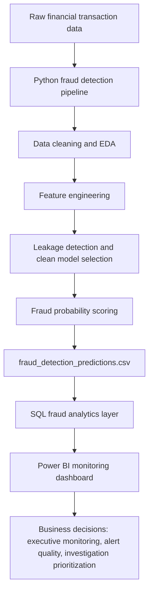
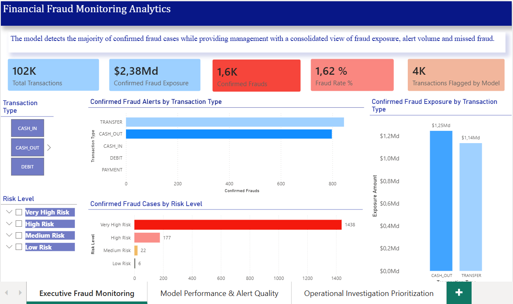
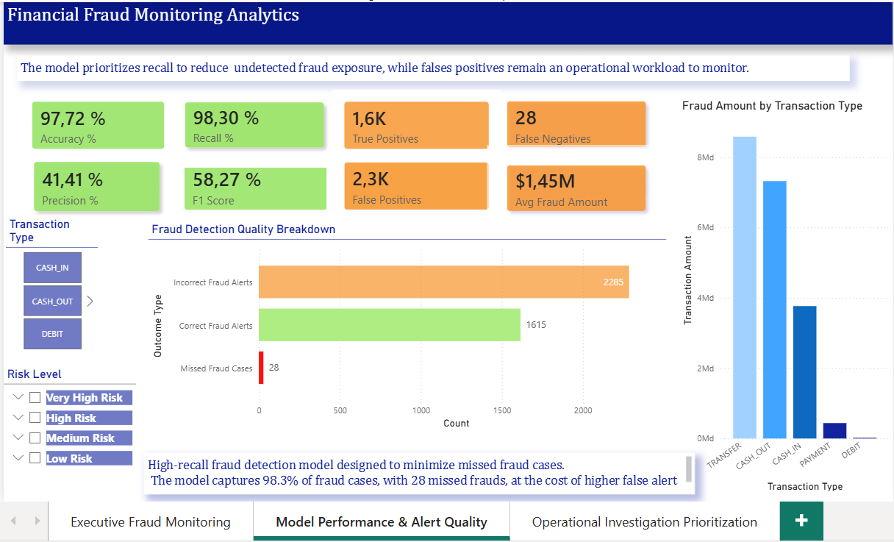
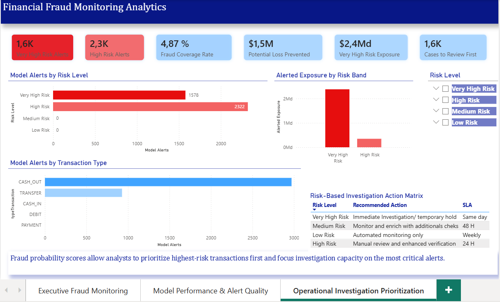

# Fraud Detection & Financial Crime Monitoring Analytics
### End-to-End Fraud Analytics Pipeline | Python • SQL • Power BI • Machine Learning • Big Data

---

# Project Overview

This project simulates a complete fraud detection and financial crime monitoring workflow designed for a fintech or digital payment environment.

The objective is to identify suspicious financial transactions using machine learning while building an end-to-end operational analytics pipeline integrating:

* Python & Machine Learning
* SQL Fraud Analytics
* Power BI Monitoring Dashboards
* Business-Oriented Fraud Investigation Logic

The project was developed with a strong focus on real-world fraud operations rather than purely academic modeling.

---

# Business Problem

Financial institutions and fintech companies process millions of transactions daily. Fraudulent transactions represent a very small proportion of overall activity, making fraud detection a highly imbalanced classification problem.

The challenge is not only to detect fraud accurately, but also to:

* minimize missed fraud cases (false negatives),
* control operational investigation workload,
* prioritize high-risk alerts,
* provide actionable monitoring dashboards for fraud analysts and risk teams.

This project reproduces a realistic fraud monitoring environment where data science, SQL analytics and business intelligence tools work together to support operational decision-making.

---

# Project Objectives

The project aims to:

* Detect potentially fraudulent transactions using machine learning
* Build a realistic fraud scoring workflow
* Handle extreme class imbalance
* Detect and remove leakage-prone variables
* Create operational fraud monitoring indicators
* Export prediction results for downstream analytics
* Build executive and investigation-focused dashboards
* Simulate a production-style fraud analytics pipeline

---

# Dataset

The project uses the PaySim synthetic financial transaction dataset containing more than 6 million mobile money transactions.

### Main Variables

* Transaction type
* Transaction amount
* Origin account balances
* Destination account balances
* Fraud label
* Fraud flag indicators

Each row represents a single financial transaction.

---

# Project Architecture



## Repository Flow

1. **Python notebook** builds the fraud detection model and exports prediction outputs.
2. **CSV output** stores model predictions, actual labels and fraud probability scores.
3. **SQL layer** transforms model outputs into fraud monitoring KPIs and investigation queries.
4. **Power BI dashboard** presents executive and operational monitoring views.
5. **README** explains business context, methodology, results and project impact.
```

---

# Python & Machine Learning Workflow

## 1. Data Understanding & Exploration

The first phase focused on:

* dataset structure validation,
* missing value analysis,
* fraud distribution analysis,
* transaction type behavior,
* exploratory fraud patterns.

The dataset presents a highly imbalanced fraud distribution, which required adapted evaluation metrics and business-oriented modeling decisions.

---

## 2. Feature Engineering

Several fraud-oriented features were created to improve fraud detection capability.

### Examples

* high-risk transaction type flag,
* transaction behavior indicators,
* encoded transaction categories.

The objective was to reproduce signals typically used in fraud monitoring environments.

---

## 3. Leakage Detection & Model Cleaning

A major part of the project focused on identifying leakage-prone variables.

Certain balance variables artificially revealed fraud outcomes and generated unrealistically high model performance.

A clean model was therefore rebuilt using only operationally realistic features.

This step significantly improved the credibility of the project and aligned the workflow with real-world fraud monitoring conditions.

---

## 4. Fraud Modeling

Two approaches were evaluated:

### Baseline Model

Initial fraud detection benchmark.

### Clean Random Forest Model

Final operational model trained on realistic fraud indicators.

The model was optimized for:

* fraud recall,
* operational monitoring,
* investigation prioritization.

---

# Model Results

| Metric            | Value             |
| ----------------- | ----------------- |
| ROC AUC           | 0.98              |
| Recall (Fraud)    | 98.3%             |
| Precision (Fraud) | 41.4%             |
| False Negatives   | 28                |
| Dataset Size      | 6.3M transactions |

The final clean fraud model prioritizes fraud recall while maintaining operationally manageable investigation volume.

---

# Evaluation Metrics

Traditional accuracy is not sufficient for fraud detection due to severe class imbalance.

The project therefore focused on:

* Recall
* Precision
* ROC AUC
* Average Precision
* Confusion Matrix analysis

Special attention was given to:

* false negatives (missed fraud),
* false positives (operational friction),
* fraud investigation workload.

---

# Fraud-Aware Sampling Strategy

To keep the notebook reproducible and recruiter-friendly while preserving fraud representation, the final clean Random Forest model was trained using:

* all fraudulent transactions from the training set,
* a representative sample of legitimate transactions.

This approach reduces computational cost while maintaining realistic fraud learning behavior.

---

# SQL Fraud Analytics Layer

Prediction outputs were exported into SQL-ready datasets to simulate operational fraud monitoring.

The SQL layer was used to:

* monitor fraud exposure,
* analyze fraud transaction behavior,
* evaluate alert volumes,
* identify high-risk transaction patterns,
* support investigation prioritization.

This reproduces the type of analytics commonly performed by fraud operations and financial crime teams.

---

# Power BI Dashboards

The Power BI environment was designed for operational and executive fraud monitoring.

## Dashboard Pages

### 1. Executive Fraud Monitoring

High-level fraud KPIs and exposure indicators.

### 2. Model Performance & Alert Quality

Evaluation of fraud detection efficiency and operational trade-offs.

### 3. Operational Investigation Prioritization

Identification and prioritization of high-risk alerts requiring investigation.

The dashboards were built to simulate real fraud monitoring workflows used in fintech and payment environments.

---

# Dashboard Preview

## Executive Fraud Monitoring



## Model Performance & Alert Quality



## Investigation Prioritization



---

# Business Impact

The project highlights the trade-off between:

* fraud detection capability,
* operational investigation workload,
* false positive management.

A high fraud recall was prioritized to reduce missed fraud exposure while maintaining acceptable operational investigation volume.

The workflow demonstrates how machine learning models can support fraud analysts and risk teams in prioritizing investigations and monitoring suspicious activity.

---

# Technologies Used

## Python

* pandas
* NumPy
* scikit-learn
* matplotlib
* seaborn

## SQL

* Fraud monitoring queries
* KPI aggregation
* Operational analytics

## Power BI

* Executive dashboards
* Investigation monitoring
* Fraud KPI visualization

---

# Repository Structure

```text
Fraud-Detection-Project/
│
├── notebook/
│   └── Detection_Fraud_Project.ipynb
│
├── data/
│   ├── raw/
│   │   └── First_Dataset_CT.csv
│   │
│   └── processed/
│       └── fraud_detection_predictions.csv
│
├── sql/
│   └── fraud_detection_analysis.sql
│
├── powerbi/
│   └── Fraud-Detection_Dashboard_Monitoring.pbix
│
├── images/
│   └── dashboard_screenshots/
│
└── README.md
```

---

# Key Skills Demonstrated

* Fraud Detection Analytics
* Financial Crime Monitoring
* Machine Learning for Risk Analytics
* Leakage Detection
* Class Imbalance Handling
* SQL Fraud Analytics
* Business Intelligence & Dashboarding
* Operational Risk Thinking
* End-to-End Analytics Pipeline Design

---

---

# Business Impact

This project was designed as a fraud analytics and operational risk monitoring workflow, not only as a machine learning classification exercise. The objective is to help a financial institution or fintech detect suspicious transactions, prioritize investigations and monitor fraud exposure.

## Key Outcomes

- **High fraud detection coverage:** the final model detects the large majority of confirmed fraud cases, reducing undetected fraud exposure.
- **Financial exposure monitoring:** fraud amount analysis shows how much fraudulent value was detected versus missed.
- **Alert prioritization:** fraud probability scores allow analysts to investigate the highest-risk transactions first.
- **Operational workload visibility:** false positives are measured to understand investigation workload and alert quality.
- **Transaction-type risk segmentation:** TRANSFER and CASH_OUT transactions are identified as the most fraud-sensitive categories.
- **Executive reporting:** SQL outputs and Power BI dashboards convert model predictions into KPIs understandable by fraud, risk and management teams.

## Business Trade-Off

The selected approach intentionally prioritizes **recall** over precision. In fraud detection, missing fraudulent transactions can create direct financial losses and operational risk. A higher number of false positives is therefore acceptable when the business objective is to minimize missed fraud and support manual investigation prioritization.

## Operational Use Case

The workflow can support a fraud operations team by:

1. scoring new transactions,
2. ranking alerts by fraud probability,
3. monitoring fraud exposure by transaction type,
4. reviewing missed fraud and false positive patterns,
5. adjusting thresholds based on analyst capacity and risk appetite.

---

# Conclusion

This project demonstrates how fraud analytics can be integrated into a complete operational monitoring workflow combining:

* machine learning,
* SQL analytics,
* dashboard reporting,
* and business-oriented investigation logic.

The objective was not only to build a predictive model, but to reproduce a realistic fraud monitoring environment similar to those used by fintech, payment and financial crime teams.
